# Gestion des Images avec MinIO

## 📋 Table des matières
1. [Vue d'ensemble](#vue-densemble)
2. [Architecture](#architecture)
3. [Configuration MinIO](#configuration-minio)
4. [Flux de traitement des images](#flux-de-traitement-des-images)
5. [Implémentation technique](#implémentation-technique)
6. [Statuts des images](#statuts-des-images)
7. [Sécurité et URL présignées](#sécurité-et-url-présignées)
8. [Exemples d'utilisation](#exemples-dutilisation)
9. [Tests](#tests)
10. [Bonnes pratiques](#bonnes-pratiques)

---

## Vue d'ensemble

Le projet **PayToGether** utilise **MinIO** comme solution de stockage d'objets pour gérer les images des deals, publicités et profils utilisateurs. MinIO est un serveur de stockage d'objets compatible avec l'API Amazon S3.

### Fonctionnalités principales :
- ✅ Stockage sécurisé des images dans MinIO
- ✅ Génération d'URL présignées temporaires pour l'upload
- ✅ Gestion des statuts des images (PENDING, UPLOADED, FAILED)
- ✅ Nommage unique avec timestamp pour éviter les collisions
- ✅ Support multi-entités (Deal, Publicité, Utilisateur)

---

## Architecture

### Composants impliqués

```
┌─────────────────────────────────────────────────────────────┐
│                        Frontend (React)                      │
│  - Upload d'image via formulaire                            │
│  - Utilisation de l'URL présignée                           │
└──────────────────────┬──────────────────────────────────────┘
                       │
                       │ HTTP POST (multipart/form-data)
                       ▼
┌─────────────────────────────────────────────────────────────┐
│                    BFF-API (Resource Layer)                  │
│  - DealResource                                              │
│  - PubliciteResource                                         │
│  - UtilisateurResource                                       │
└──────────────────────┬──────────────────────────────────────┘
                       │
                       │ DTO → Modèle
                       ▼
┌─────────────────────────────────────────────────────────────┐
│                 BFF-CORE (Service Layer)                     │
│  - DealServiceImpl                                           │
│  - PubliciteServiceImpl                                      │
│  - UtilisateurServiceImpl                                    │
└──────────────────────┬──────────────────────────────────────┘
                       │
                       │ Appel Provider
                       ▼
┌─────────────────────────────────────────────────────────────┐
│              BFF-PROVIDER (Adapter Layer)                    │
│  - DealProviderAdapter                                       │
│  - PubliciteProviderAdapter                                  │
│  - UtilisateurProviderAdapter                                │
│  - FileManager ◄──────────────┐                             │
└──────────────────────┬─────────┴───────────────────────────┘
                       │                 │
                       │ JPA             │ MinIO Client
                       ▼                 ▼
              ┌────────────────┐  ┌──────────────┐
              │   PostgreSQL   │  │    MinIO     │
              │   (Metadata)   │  │  (Storage)   │
              └────────────────┘  └──────────────┘
```

### Flux de données

1. **Création d'entité avec image** :
   - Frontend envoie les métadonnées de l'image
   - Backend crée l'entité avec statut `PENDING`
   - FileManager génère une URL présignée
   - Frontend upload l'image directement sur MinIO
   - Statut passe à `UPLOADED` après confirmation

2. **Lecture d'entité avec image** :
   - Backend récupère les métadonnées depuis PostgreSQL
   - Pour les images `PENDING`, génère des URL présignées temporaires
   - Frontend affiche l'image via l'URL présignée

3. **Modification d'image** :
   - Détection du changement d'URL
   - Ajout de timestamp unique au nom
   - Statut repasse à `PENDING`
   - Nouvelle URL présignée générée

---

## Configuration MinIO

### 1. Configuration application.yml

```yaml
# Configuration MinIO
minio:
  endpoint: http://minio:9000
  accessKey: minioadmin
  secretKey: minioadmin
  bucketName: paytogether-images
  presignedUrlExpiration: 3600 # Durée en secondes (1 heure)

# Configuration pour environnement local
spring:
  profiles: local
minio:
  endpoint: http://localhost:9000
```

### 2. Dépendances Maven (pom.xml)

```xml
<!-- Module bff-provider -->
<dependency>
    <groupId>io.minio</groupId>
    <artifactId>minio</artifactId>
    <version>8.5.7</version>
</dependency>
```

### 3. Bean de configuration MinIO

```java
@Configuration
public class MinioConfiguration {

    @Value("${minio.endpoint}")
    private String endpoint;

    @Value("${minio.accessKey}")
    private String accessKey;

    @Value("${minio.secretKey}")
    private String secretKey;

    @Value("${minio.bucketName}")
    private String bucketName;

    @Bean
    public MinioClient minioClient() {
        return MinioClient.builder()
                .endpoint(endpoint)
                .credentials(accessKey, secretKey)
                .build();
    }

    @PostConstruct
    public void initializeBucket() {
        try {
            MinioClient client = minioClient();
            boolean bucketExists = client.bucketExists(
                BucketExistsArgs.builder()
                    .bucket(bucketName)
                    .build()
            );
            
            if (!bucketExists) {
                client.makeBucket(
                    MakeBucketArgs.builder()
                        .bucket(bucketName)
                        .build()
                );
            }
        } catch (Exception e) {
            throw new RuntimeException("Erreur lors de l'initialisation du bucket MinIO", e);
        }
    }
}
```

---

## Flux de traitement des images

### 1. Création d'un Deal avec images

```mermaid
sequenceDiagram
    participant F as Frontend
    participant A as API
    participant S as Service
    participant P as Provider
    participant FM as FileManager
    participant M as MinIO

    F->>A: POST /api/deals (avec liste images)
    A->>S: creer(deal)
    S->>P: sauvegarder(deal)
    
    Note over P: Ajoute timestamp aux noms
    P->>P: urlImage + "_" + timestamp
    P->>Database: save(dealJpa)
    P->>FM: generatePresignedUrl(urlImage)
    FM->>M: getPresignedObjectUrl()
    M-->>FM: URL présignée
    FM-->>P: URL présignée
    P-->>S: DealModele (avec presignUrl)
    S-->>A: DealModele
    A-->>F: DealDTO (avec presignUrl)
    
    F->>M: PUT {presignUrl} (upload image)
    M-->>F: 200 OK
    F->>A: PATCH /api/deals/{id}/images/{imageId}/status
    A->>S: mettreAJourStatutImage(UPLOADED)
```



### 2. Lecture d'un Deal avec images

```mermaid
sequenceDiagram
    participant F as Frontend
    participant A as API
    participant S as Service
    participant P as Provider
    participant FM as FileManager
    participant M as MinIO

    F->>A: GET /api/deals/{uuid}
    A->>S: lireParUuid(uuid)
    S->>P: trouverParUuid(uuid)
    P->>Database: findById(uuid)
    Database-->>P: DealJpa (avec images)
    
    Note over P: Filtre images PENDING
    P->>FM: generatePresignedUrl() pour chaque image PENDING
    FM->>M: getPresignedObjectUrl()
    M-->>FM: URL présignée
    FM-->>P: URL présignée
    
    P-->>S: DealModele (avec presignUrl)
    S-->>A: DealModele
    A-->>F: DealDTO (avec presignUrl)
    
    F->>M: GET {presignUrl}
    M-->>F: Image binaire
```



### 3. Mise à jour d'une image

```mermaid
sequenceDiagram
    participant F as Frontend
    participant A as API
    participant P as Provider
    participant FM as FileManager
    participant M as MinIO

    F->>A: PUT /api/deals/{uuid} (nouvelle image)
    A->>P: mettreAJour(uuid, deal)
    
    Note over P: Détecte changement URL
    P->>P: Compare urlImage existante vs nouvelle
    
    alt URL différente
        P->>P: urlImage + "_" + timestamp
        P->>P: statut = PENDING
        P->>P: dateModification = now()
        P->>Database: save(dealJpa)
        P->>FM: generatePresignedUrl(nouvelle URL)
        FM->>M: getPresignedObjectUrl()
        M-->>FM: URL présignée
        FM-->>P: URL présignée
    else URL identique
        P->>Database: save(dealJpa)
    end
    
    P-->>A: DealModele
    A-->>F: DealDTO (avec presignUrl si modifiée)
```



---

## Implémentation technique

### 1. FileManager (bff-provider)

```java
@Component
@RequiredArgsConstructor
@Slf4j
public class FileManager {

    private final MinioClient minioClient;
    
    @Value("${minio.bucketName}")
    private String bucketName;
    
    @Value("${minio.presignedUrlExpiration:3600}")
    private int presignedUrlExpiration;

    /**
     * Génère une URL présignée pour l'upload d'une image
     * 
     * @param nomFichier le nom du fichier (avec timestamp unique)
     * @return l'URL présignée valide pendant 1 heure
     */
    public String generatePresignedUrl(String nomFichier) {
        try {
            log.debug("Génération d'URL présignée pour: {}", nomFichier);
            
            String presignedUrl = minioClient.getPresignedObjectUrl(
                GetPresignedObjectUrlArgs.builder()
                    .method(Method.PUT)
                    .bucket(bucketName)
                    .object(nomFichier)
                    .expiry(presignedUrlExpiration)
                    .build()
            );
            
            log.debug("URL présignée générée avec succès");
            return presignedUrl;
            
        } catch (Exception e) {
            log.error("Erreur lors de la génération de l'URL présignée: {}", e.getMessage());
            throw new RuntimeException("Impossible de générer l'URL présignée", e);
        }
    }

    /**
     * Génère une URL présignée pour la lecture d'une image
     * 
     * @param nomFichier le nom du fichier
     * @return l'URL présignée pour la lecture
     */
    public String generatePresignedUrlForRead(String nomFichier) {
        try {
            return minioClient.getPresignedObjectUrl(
                GetPresignedObjectUrlArgs.builder()
                    .method(Method.GET)
                    .bucket(bucketName)
                    .object(nomFichier)
                    .expiry(presignedUrlExpiration)
                    .build()
            );
        } catch (Exception e) {
            log.error("Erreur lors de la génération de l'URL de lecture: {}", e.getMessage());
            throw new RuntimeException("Impossible de générer l'URL de lecture", e);
        }
    }

    /**
     * Supprime un fichier du bucket MinIO
     * 
     * @param nomFichier le nom du fichier à supprimer
     */
    public void supprimerFichier(String nomFichier) {
        try {
            log.info("Suppression du fichier: {}", nomFichier);
            
            minioClient.removeObject(
                RemoveObjectArgs.builder()
                    .bucket(bucketName)
                    .object(nomFichier)
                    .build()
            );
            
            log.info("Fichier supprimé avec succès");
            
        } catch (Exception e) {
            log.error("Erreur lors de la suppression du fichier: {}", e.getMessage());
            // Ne pas throw pour éviter de bloquer la suppression de l'entité
        }
    }
}
```

### 2. DealProviderAdapter - Méthode sauvegarder()

```java
@Override
public DealModele sauvegarder(DealModele deal) {
    DealJpa entite = mapper.versEntite(deal);

    // Mettre à jour les noms des fichiers avec timestamp unique
    if (deal.getListeImages() != null && !deal.getListeImages().isEmpty()) {
        List<ImageDealJpa> imageDealJpas = deal.getListeImages().stream()
                .map(imageDealModele -> ImageDealJpa.builder()
                        .uuid(imageDealModele.getUuid())
                        .urlImage(imageDealModele.getUrlImage() + "_" + System.currentTimeMillis())
                        .isPrincipal(imageDealModele.getIsPrincipal())
                        .statut(imageDealModele.getStatut())
                        .dealJpa(entite)
                        .build())
                .toList();
        entite.setImageDealJpas(imageDealJpas);
    }

    DealJpa sauvegarde = jpaRepository.save(entite);
    DealModele modeleSauvegarde = mapper.versModele(sauvegarde);

    // Générer les URL présignées pour les images PENDING
    setPresignUrl(modeleSauvegarde);

    return modeleSauvegarde;
}

private void setPresignUrl(DealModele modeleSauvegarde) {
    // Générer URL présignée uniquement pour les images PENDING
    if (modeleSauvegarde.getListeImages() != null && !modeleSauvegarde.getListeImages().isEmpty()) {
        modeleSauvegarde.getListeImages().stream()
                .filter(imageDealModele -> imageDealModele.getStatut() == StatutImageDeal.PENDING)
                .forEach(imageDealModele -> {
                    String presignedUrl = fileManager.generatePresignedUrl(imageDealModele.getUrlImage());
                    imageDealModele.setPresignUrl(presignedUrl);
                });
    }
}
```

### 3. DealProviderAdapter - Méthode mettreAJour()

```java
@Override
public DealModele mettreAJour(UUID uuid, DealModele deal) {
    DealJpa entite = jpaRepository.findById(uuid)
            .map(jpa -> {
                mapper.mettreAJour(jpa, deal);
                mettreAJourImagesSiBesoin(jpa, deal);
                return jpaRepository.save(jpa);
            })
            .orElseThrow(() -> new IllegalArgumentException("Deal non trouvé pour l'UUID : " + uuid));

    DealModele modeleSauvegarde = mapper.versModele(entite);
    setPresignUrl(modeleSauvegarde);
    return modeleSauvegarde;
}

private void mettreAJourImagesSiBesoin(DealJpa jpa, DealModele deal) {
    if (jpa.getImageDealJpas() == null || jpa.getImageDealJpas().isEmpty()) {
        return;
    }
    if (deal.getListeImages() == null || deal.getListeImages().isEmpty()) {
        return;
    }

    // Mapper les images par UUID pour comparaison rapide
    var imagesParUuid = deal.getListeImages().stream()
            .filter(image -> image.getUuid() != null)
            .collect(Collectors.toMap(
                    ImageDealModele::getUuid,
                    image -> image
            ));

    // Mettre à jour chaque image si l'URL a changé
    jpa.getImageDealJpas().forEach(imageJpa -> {
        var imageModele = imagesParUuid.get(imageJpa.getUuid());
        if (imageModele != null && !imageJpa.getUrlImage().equals(imageModele.getUrlImage())) {
            // URL modifiée : ajouter timestamp et repasser en PENDING
            imageJpa.setUrlImage(imageModele.getUrlImage() + "_" + System.currentTimeMillis());
            imageJpa.setStatut(StatutImageDeal.PENDING);
            imageJpa.setDateModification(LocalDateTime.now());
        }
    });
}
```

### 4. PubliciteProviderAdapter (Même pattern)

```java
@Component
@RequiredArgsConstructor
public class PubliciteProviderAdapter implements PubliciteProvider {

    private final PubliciteRepository jpaRepository;
    private final PubliciteJpaMapper mapper;
    private final FileManager fileManager;

    @Override
    public PubliciteModele sauvegarder(PubliciteModele publicite) {
        PubliciteJpa entite = mapper.versEntite(publicite);

        // Ajouter timestamp aux images
        if (publicite.getListeImages() != null && !publicite.getListeImages().isEmpty()) {
            List<ImageJpa> imageJpas = publicite.getListeImages().stream()
                    .map(imageModele -> ImageJpa.builder()
                            .uuid(imageModele.getUuid())
                            .urlImage(imageModele.getUrlImage() + "_" + System.currentTimeMillis())
                            .statut(imageModele.getStatut())
                            .build())
                    .toList();
            entite.setListeImages(imageJpas);
        }

        PubliciteJpa sauvegarde = jpaRepository.save(entite);
        PubliciteModele modeleSauvegarde = mapper.versModele(sauvegarde);

        setPresignUrl(modeleSauvegarde);

        return modeleSauvegarde;
    }

    private void setPresignUrl(PubliciteModele modeleSauvegarde) {
        if (modeleSauvegarde.getListeImages() != null && !modeleSauvegarde.getListeImages().isEmpty()) {
            modeleSauvegarde.getListeImages().stream()
                    .filter(imageModele -> imageModele.getStatut() == StatutImage.PENDING)
                    .forEach(imageModele -> {
                        String presignedUrl = fileManager.generatePresignedUrl(imageModele.getUrlImage());
                        imageModele.setPresignUrl(presignedUrl);
                    });
        }
    }

    // Même logique pour mettreAJour()...
}
```

### 5. UtilisateurProviderAdapter (Photo de profil)

```java
@Override
public UtilisateurModele sauvegarder(UtilisateurModele utilisateur) {
    UtilisateurJpa entite = mapper.versEntite(utilisateur);
    
    // Modifier le nom de la photo de profil avec timestamp
    if (entite.getPhotoProfil() != null) {
        entite.setPhotoProfilUnique(entite.getPhotoProfil().getUrlImage());
    }
    
    UtilisateurModele modele = mapper.versModele(jpaRepository.save(entite));
    
    // Générer URL présignée si photo PENDING
    if (modele.getPhotoProfil() != null) {
        String presignUrl = fileManager.generatePresignedUrl(modele.getPhotoProfil().getUrlImage());
        modele.setPresignUrlPhotoProfil(presignUrl);
    }
    
    return modele;
}
```

---

## Statuts des images

### Énumération StatutImage

```java
package com.ulr.paytogether.core.enumeration;

public enum StatutImage {
    /**
     * Image en attente d'upload - URL présignée générée
     */
    PENDING,
    
    /**
     * Image uploadée avec succès sur MinIO
     */
    UPLOADED,
    
    /**
     * Échec de l'upload de l'image
     */
    FAILED
}
```

### Cycle de vie d'une image

```
┌──────────┐
│  CREATE  │
└─────┬────┘
      │
      ▼
┌──────────────┐
│   PENDING    │ ◄────────────┐
└──────┬───────┘              │
       │                      │
       │ Upload réussi        │ Modification URL
       ▼                      │
┌──────────────┐              │
│   UPLOADED   │──────────────┘
└──────┬───────┘
       │
       │ Erreur upload
       ▼
┌──────────────┐
│    FAILED    │
└──────────────┘
```

### Gestion des statuts

1. **PENDING** :
   - État initial après création/modification
   - URL présignée générée automatiquement
   - Durée de validité : 1 heure (configurable)
   - Frontend doit uploader avant expiration

2. **UPLOADED** :
   - Image stockée avec succès sur MinIO
   - Pas de génération d'URL présignée (pas nécessaire)
   - Image accessible via URL directe ou présignée GET

3. **FAILED** :
   - Upload échoué ou expiré
   - Peut être réinitialisé à PENDING pour retry
   - Logs d'erreur dans le backend

---

## Sécurité et URL présignées

### Avantages des URL présignées

1. **Sécurité** :
   - Pas d'exposition des credentials MinIO au frontend
   - Accès temporaire limité dans le temps
   - Permissions spécifiques (PUT ou GET)

2. **Performance** :
   - Upload direct du frontend vers MinIO
   - Pas de transit par le backend
   - Réduction de la charge serveur

3. **Simplicité** :
   - Pas de gestion de sessions d'upload
   - Pas de chunking complexe
   - Retry automatique possible côté frontend

### Configuration de sécurité

```yaml
# application-prod.yml
minio:
  endpoint: https://minio.paytogether.ca
  accessKey: ${MINIO_ACCESS_KEY}
  secretKey: ${MINIO_SECRET_KEY}
  bucketName: paytogether-images-prod
  presignedUrlExpiration: 1800 # 30 minutes en production

# Politique de bucket MinIO
bucketPolicy: |
  {
    "Version": "2012-10-17",
    "Statement": [
      {
        "Effect": "Allow",
        "Principal": {"AWS": ["*"]},
        "Action": ["s3:GetObject"],
        "Resource": ["arn:aws:s3:::paytogether-images-prod/*"]
      }
    ]
  }
```

---

## Exemples d'utilisation

### 1. Créer un Deal avec images (Frontend React)

```typescript
// 1. Créer le deal avec métadonnées d'images
const creerDealAvecImages = async (dealData: DealFormData) => {
  const response = await fetch('/api/deals', {
    method: 'POST',
    headers: { 'Content-Type': 'application/json' },
    body: JSON.stringify({
      titre: dealData.titre,
      description: dealData.description,
      prixDeal: dealData.prix,
      listeImages: dealData.images.map(img => ({
        urlImage: img.name, // Nom original du fichier
        isPrincipal: img.isPrincipal,
        statut: 'PENDING'
      }))
    })
  });
  
  const dealCree = await response.json();
  
  // 2. Uploader chaque image avec l'URL présignée
  for (const image of dealCree.listeImages) {
    if (image.presignUrl && image.statut === 'PENDING') {
      const file = dealData.images.find(f => f.name === image.urlImage.split('_')[0]);
      
      await fetch(image.presignUrl, {
        method: 'PUT',
        body: file,
        headers: {
          'Content-Type': file.type
        }
      });
      
      // 3. Confirmer l'upload
      await fetch(`/api/deals/${dealCree.uuid}/images/${image.uuid}/confirm`, {
        method: 'PATCH'
      });
    }
  }
  
  return dealCree;
};
```

### 2. Afficher une image avec URL présignée

```typescript
const AfficherImageDeal: React.FC<{ deal: Deal }> = ({ deal }) => {
  const [imageUrl, setImageUrl] = useState<string>('');

  useEffect(() => {
    const chargerImage = async () => {
      if (deal.listeImages && deal.listeImages.length > 0) {
        const imagePrincipale = deal.listeImages.find(img => img.isPrincipal);
        
        if (imagePrincipale.statut === 'PENDING' && imagePrincipale.presignUrl) {
          // Utiliser l'URL présignée pour les images en attente
          setImageUrl(imagePrincipale.presignUrl);
        } else if (imagePrincipale.statut === 'UPLOADED') {
          // Récupérer une URL de lecture pour les images uploadées
          const response = await fetch(`/api/deals/${deal.uuid}/images/${imagePrincipale.uuid}/url`);
          const data = await response.json();
          setImageUrl(data.url);
        }
      }
    };
    
    chargerImage();
  }, [deal]);

  return (
     setImageUrl('/images/placeholder.jpg')}
    />
  );
};
```

### 3. Backend - Endpoint pour confirmer l'upload

```java
@PatchMapping("/{dealUuid}/images/{imageUuid}/confirm")
public ResponseEntity<Void> confirmerUploadImage(
        @PathVariable UUID dealUuid,
        @PathVariable UUID imageUuid) {
    
    log.info("Confirmation upload image {} pour deal {}", imageUuid, dealUuid);
    
    dealService.mettreAJourStatutImage(dealUuid, imageUuid, StatutImageDeal.UPLOADED);
    
    return ResponseEntity.ok().build();
}
```

### 4. Backend - Endpoint pour obtenir URL de lecture

```java
@GetMapping("/{dealUuid}/images/{imageUuid}/url")
public ResponseEntity<Map<String, String>> obtenirUrlImage(
        @PathVariable UUID dealUuid,
        @PathVariable UUID imageUuid) {
    
    String urlLecture = dealService.obtenirUrlLectureImage(dealUuid, imageUuid);
    
    return ResponseEntity.ok(Map.of("url", urlLecture));
}
```

---

## Tests

### 1. Test de génération d'URL présignée

```java
@Test
void testSauvegarder_AvecImages_DevraitGenererUrlPresignee() {
    // Given
    ImageDealModele imagePending = ImageDealModele.builder()
            .uuid(UUID.randomUUID())
            .urlImage("deal_image.jpg")
            .statut(StatutImageDeal.PENDING)
            .build();

    DealModele dealAvecImages = DealModele.builder()
            .uuid(UUID.randomUUID())
            .titre("Deal avec images")
            .listeImages(List.of(imagePending))
            .build();

    when(fileManager.generatePresignedUrl(anyString()))
            .thenReturn("https://minio:9000/bucket/deal_image_123456789.jpg?signature=...");

    // When
    DealModele resultat = providerAdapter.sauvegarder(dealAvecImages);

    // Then
    assertNotNull(resultat.getListeImages().get(0).getPresignUrl());
    assertTrue(resultat.getListeImages().get(0).getPresignUrl().contains("signature"));
    verify(fileManager, times(1)).generatePresignedUrl(anyString());
}
```

### 2. Test de mise à jour avec changement d'image

```java
@Test
void testMettreAJour_AvecNouvelleImage_DevraitMettreStatutPending() {
    // Given
    ImageDealModele nouvelleImage = ImageDealModele.builder()
            .uuid(UUID.randomUUID())
            .urlImage("nouvelle_image.jpg")
            .statut(StatutImageDeal.PENDING)
            .build();

    ImageDealJpa ancienneImageJpa = ImageDealJpa.builder()
            .uuid(nouvelleImage.getUuid())
            .urlImage("ancienne_image.jpg")
            .statut(StatutImageDeal.UPLOADED)
            .build();

    // When
    DealModele resultat = providerAdapter.mettreAJour(dealUuid, dealAvecNouvelleImage);

    // Then
    assertEquals(StatutImageDeal.PENDING, ancienneImageJpa.getStatut());
    assertTrue(ancienneImageJpa.getUrlImage().contains("_")); // Timestamp ajouté
    verify(fileManager, times(1)).generatePresignedUrl(anyString());
}
```

### 3. Test d'intégration avec MinIO (TestContainers)

```java
@SpringBootTest
@Testcontainers
class MinioIntegrationTest {

    @Container
    static MinIOContainer minioContainer = new MinIOContainer("minio/minio:latest")
            .withUserName("minioadmin")
            .withPassword("minioadmin");

    @Autowired
    private FileManager fileManager;

    @Test
    void testUploadEtLectureImage() throws Exception {
        // Given
        String nomFichier = "test_image_" + System.currentTimeMillis() + ".jpg";
        byte[] contenuImage = "fake image content".getBytes();

        // When - Génération URL présignée
        String urlPresignee = fileManager.generatePresignedUrl(nomFichier);

        // Upload via URL présignée
        HttpURLConnection connection = (HttpURLConnection) new URL(urlPresignee).openConnection();
        connection.setRequestMethod("PUT");
        connection.setDoOutput(true);
        connection.getOutputStream().write(contenuImage);
        int responseCode = connection.getResponseCode();

        // Then
        assertEquals(200, responseCode);

        // Vérification lecture
        String urlLecture = fileManager.generatePresignedUrlForRead(nomFichier);
        HttpURLConnection readConnection = (HttpURLConnection) new URL(urlLecture).openConnection();
        byte[] contenuLu = readConnection.getInputStream().readAllBytes();

        assertArrayEquals(contenuImage, contenuLu);
    }
}
```

---

## Bonnes pratiques

### 1. Nommage des fichiers

✅ **À faire** :
```java
// Ajouter timestamp pour unicité
String nomUnique = nomOriginal + "_" + System.currentTimeMillis();

// Préfixer par type d'entité
String nomAvecPrefixe = "deal/" + dealUuid + "/" + nomOriginal + "_" + timestamp;

// Nettoyer les caractères spéciaux
String nomNettoye = nomOriginal
    .replaceAll("[^a-zA-Z0-9.-]", "_")
    .toLowerCase();
```

❌ **À éviter** :
```java
// Pas de timestamp - risque de collision
String nom = "image.jpg";

// Caractères spéciaux non échappés
String nom = "mon image (1).jpg";

// Noms prévisibles - risque de sécurité
String nom = "utilisateur_" + userId + ".jpg";
```

### 2. Gestion des erreurs

```java
@Override
public String generatePresignedUrl(String nomFichier) {
    try {
        return minioClient.getPresignedObjectUrl(...);
    } catch (MinioException e) {
        log.error("Erreur MinIO: {}", e.getMessage());
        throw new StorageException("Erreur de stockage", e);
    } catch (Exception e) {
        log.error("Erreur inattendue: {}", e.getMessage());
        throw new TechnicalException("Erreur technique", e);
    }
}
```

### 3. Nettoyage des images orphelines

```java
@Scheduled(cron = "0 0 2 * * *") // Chaque jour à 2h du matin
public void nettoyerImagesOrphelines() {
    log.info("Début du nettoyage des images orphelines");
    
    // Trouver les images PENDING depuis plus de 24h
    List<ImageDeal> imagesExpirees = imageDealRepository
        .findByStatutAndDateCreationBefore(
            StatutImageDeal.PENDING,
            LocalDateTime.now().minusHours(24)
        );
    
    imagesExpirees.forEach(image -> {
        log.warn("Suppression image expirée: {}", image.getUrlImage());
        fileManager.supprimerFichier(image.getUrlImage());
        imageDealRepository.delete(image);
    });
    
    log.info("Nettoyage terminé: {} images supprimées", imagesExpirees.size());
}
```

### 4. Monitoring et métriques

```java
@Component
@RequiredArgsConstructor
public class MinioHealthIndicator implements HealthIndicator {

    private final MinioClient minioClient;
    private final String bucketName;

    @Override
    public Health health() {
        try {
            boolean bucketExists = minioClient.bucketExists(
                BucketExistsArgs.builder()
                    .bucket(bucketName)
                    .build()
            );
            
            if (bucketExists) {
                return Health.up()
                    .withDetail("bucket", bucketName)
                    .withDetail("status", "accessible")
                    .build();
            } else {
                return Health.down()
                    .withDetail("bucket", bucketName)
                    .withDetail("error", "Bucket non trouvé")
                    .build();
            }
        } catch (Exception e) {
            return Health.down()
                .withDetail("error", e.getMessage())
                .build();
        }
    }
}
```

### 5. Validation des fichiers

```java
public void validerFichier(MultipartFile file) {
    // Taille maximale : 5 MB
    long tailleMax = 5 * 1024 * 1024;
    if (file.getSize() > tailleMax) {
        throw new ValidationException("Fichier trop volumineux (max 5 MB)");
    }
    
    // Types MIME autorisés
    List<String> typesAutorises = List.of(
        "image/jpeg",
        "image/png",
        "image/webp",
        "image/gif"
    );
    
    if (!typesAutorises.contains(file.getContentType())) {
        throw new ValidationException("Type de fichier non autorisé");
    }
    
    // Vérifier l'extension
    String nomFichier = file.getOriginalFilename();
    if (nomFichier == null || !nomFichier.matches(".*\\.(jpg|jpeg|png|webp|gif)$")) {
        throw new ValidationException("Extension de fichier invalide");
    }
}
```

### 6. Configuration Kubernetes/Docker

```yaml
# docker-compose.yml
version: '3.8'

services:
  minio:
    image: minio/minio:latest
    container_name: paytogether-minio
    ports:
      - "9000:9000"
      - "9001:9001" # Console web
    environment:
      MINIO_ROOT_USER: minioadmin
      MINIO_ROOT_PASSWORD: minioadmin
    volumes:
      - minio-data:/data
    command: server /data --console-address ":9001"
    healthcheck:
      test: ["CMD", "curl", "-f", "http://localhost:9000/minio/health/live"]
      interval: 30s
      timeout: 20s
      retries: 3

volumes:
  minio-data:
    driver: local
```

```yaml
# k8s/minio-deployment.yaml
apiVersion: apps/v1
kind: Deployment
metadata:
  name: minio
  namespace: paytogether
spec:
  replicas: 1
  selector:
    matchLabels:
      app: minio
  template:
    metadata:
      labels:
        app: minio
    spec:
      containers:
      - name: minio
        image: minio/minio:latest
        args:
        - server
        - /data
        - --console-address
        - ":9001"
        env:
        - name: MINIO_ROOT_USER
          valueFrom:
            secretKeyRef:
              name: minio-secret
              key: root-user
        - name: MINIO_ROOT_PASSWORD
          valueFrom:
            secretKeyRef:
              name: minio-secret
              key: root-password
        ports:
        - containerPort: 9000
        - containerPort: 9001
        volumeMounts:
        - name: minio-storage
          mountPath: /data
        resources:
          requests:
            memory: "512Mi"
            cpu: "250m"
          limits:
            memory: "1Gi"
            cpu: "500m"
      volumes:
      - name: minio-storage
        persistentVolumeClaim:
          claimName: minio-pvc
---
apiVersion: v1
kind: Service
metadata:
  name: minio
  namespace: paytogether
spec:
  type: ClusterIP
  ports:
  - name: api
    port: 9000
    targetPort: 9000
  - name: console
    port: 9001
    targetPort: 9001
  selector:
    app: minio
```

---

## Résumé

### Points clés
1. ✅ **FileManager** gère toutes les interactions avec MinIO
2. ✅ **Timestamp unique** ajouté automatiquement aux noms de fichiers
3. ✅ **URL présignées** générées uniquement pour statut PENDING
4. ✅ **Détection automatique** des changements d'images lors des mises à jour
5. ✅ **Pattern identique** pour Deal, Publicité et Utilisateur
6. ✅ **Tests complets** avec mocks et intégration

### Flux simplifié
```
Création → Ajout timestamp → Sauvegarde BD → Génération URL → Upload frontend → Confirmation
```

### Sécurité
- ✅ Pas d'exposition des credentials
- ✅ URL temporaires (1 heure)
- ✅ Validation des types de fichiers
- ✅ Nettoyage automatique des orphelins

---

## Références

- 📚 [Documentation MinIO](https://min.io/docs/minio/kubernetes/upstream/)
- 📚 [MinIO Java SDK](https://github.com/minio/minio-java)
- 📚 [Spring Boot avec MinIO](https://www.baeldung.com/spring-boot-minio)
- 📚 [URL présignées S3](https://docs.aws.amazon.com/AmazonS3/latest/userguide/PresignedUrlUploadObject.html)

---

**Date de création** : 8 février 2026  
**Dernière mise à jour** : 8 février 2026  
**Auteur** : Équipe PayToGether
